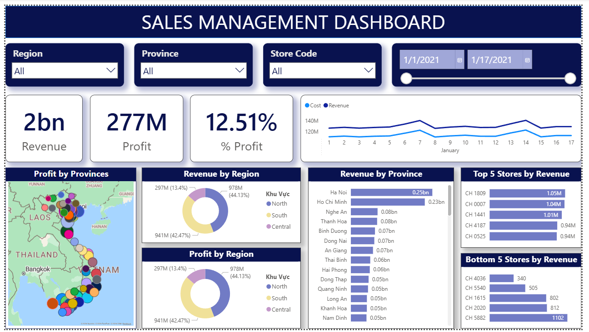

# Power BI Sales Management Dashboard Tutorial

## Overview
This tutorial demonstrates creating a comprehensive, interactive sales management dashboard in Power BI using Excel data. The dashboard features multiple visualizations, slicers, and dynamic filtering capabilities for monitoring retail sales across Vietnam's 63 provinces.

## Final Dashboard Features
- **Revenue, Profit, and Profit Margin KPIs** - Three key metric cards
- **Revenue and Cost Trend Chart** - Line chart by date
- **Profit Map Visualization** - Bubble map of Vietnam showing profit by province
- **Revenue Distribution by Region** - Donut charts (North, Central, South)
- **Revenue by Province Bar Chart** - All 63 provinces ranked
- **Top 5 and Bottom 5 Stores** - Performance comparison
- **Four Interactive Slicers:**
  - Region (North, Central, South)
  - Province (all 63 provinces with search)
  - Store (6,000 stores with search)
  - Date range (timeline slider)

> Example outputs of the completed tracker.

### Sales Management Using Power BI



---

## DATASET STRUCTURE

### Three Excel Sheets

#### 1. Province List Sheet
**Columns:**
- **Region** - Center (Central), Note (North), South
- **Province** - 63 provinces of Vietnam
- **Longitude** - Geographic coordinate (for map)
- **Latitude** - Geographic coordinate (for map)

**Purpose of coordinates:** Enable accurate plotting of provinces on Vietnam map visualization

#### 2. Store List Sheet
**Columns:**
- **Store Code** - Unique identifier (e.g., 001, 002, etc.)
- **Province** - Which province the store belongs to

**Total stores:** 5,905 stores across all provinces

#### 3. Business Results Sheet
**Columns:**
- **Date** - Transaction date
- **Store Code** - Which store
- **Revenue** - Sales amount
- **Cost** - Expenses

**Data frequency:** Daily data entry per store
**Example period:** January 1-16 (expandable to January 31)

---

## DATA IMPORT AND PREPARATION

### Importing Excel Data

#### Import Steps
1. Open Power BI Desktop (new blank file)
2. Home tab > Excel (or Get Data > Excel)
3. Navigate to data file location
4. File name example: "sales data.xlsx"

#### Navigator Window
When Excel file opens, three sheets appear:
- Province List
- Store List
- Business Results

**Select all three sheets:**
1. Check box to left of each sheet name
2. OR click "Select Multiple" option
3. All three should be checked

#### Load Options
**Two choices:**
- **Load** - Import data directly into Power BI
- **Transform Data** - Open Power Query Editor for modifications

**Recommended:** Click "Transform Data" for data cleaning and calculations

### Power Query Editor

#### Three Tables Loaded
After clicking Transform Data, Power Query Editor opens showing:
1. Business Results table
2. Province List table
3. Store List table

#### Setting Data Types
**For Province List and Store List:**
1. Click on table
2. First column (Key column) should be "Text" type
3. Icon should show "ABC" (text indicator)

**For Business Results:**
All columns should have appropriate types:
- Date: Date type
- Store Code: Text
- Revenue: Whole Number or Decimal
- Cost: Whole Number or Decimal

---

## CREATING CALCULATED COLUMNS

### Profit Column in Business Results Table

**Purpose:** Calculate profit for each transaction

#### Create Custom Column
1. Click on Business Results table
2. Add Column tab > Custom Column
3. Name: "Profit"

**DAX Formula:**
```DAX
Profit = [Revenue] - [Cost]
```

**Breakdown:**
- `[Revenue]` = Revenue column
- `-` = Subtract
- `[Cost]` = Cost column
- Result = Profit for each row

#### Format as Number
1. Select Profit column
2. Transform tab > Data Type
3. Choose "Whole Number" or "Decimal Number"

#### Formula Validation
**Green checkmark appears** if formula is correct (no syntax errors)

---

## REMOVING BLANK RECORDS

### Filter Out Stores Without Revenue

**Problem:** Some stores show Revenue = 0 (not yet operational)

**Solution:** Remove zero-revenue records

#### Steps
1. Click on Business Results table
2. Select Revenue column
3. Click dropdown arrow in column header
4. Number Filters > Greater Than
5. Enter: 0
6. Click OK

**Result:** Only stores with actual revenue remain

**Optional - Sort by Profit:**
1. Click Profit column header
2. Sort Descending (largest to smallest)
3. Highest-profit transactions appear first

---

## CREATING RELATIONSHIPS (DATA MODEL)

### Understanding Relationships

**Location:** View tab > Model View (or click Model icon on left)

**Three tables appear:**
- Business Results
- Store List
- Province List

**Relationship lines (arrows):**
Connect tables through common fields

#### Relationship 1: Business Results ↔ Store List
**Common field:** Store Code
- Business Results.Store Code
- Store List.Store Code

**Cardinality:** Many-to-One
- Many transactions per store
- Each store appears once in Store List

#### Relationship 2: Store List ↔ Province List
**Common field:** Province
- Store List.Province
- Province List.Province

**Cardinality:** Many-to-One
- Many stores per province
- Each province appears once in Province List

### Managing Relationships

**Auto-detected:** Power BI usually creates relationships automatically

**If relationship is wrong:**
1. Right-click relationship line
2. Delete
3. Manually create new relationship:
   - Click and drag from one field
   - Drop onto matching field in other table
4. Verify relationship is correct

**Why relationships matter:**
- Filter one table → Related tables filter automatically
- Slicers can affect multiple tables
- Enables cross-table calculations

---

## LOADING DATA TO POWER BI

### Close & Apply

**After data preparation complete:**
1. Home tab > Close & Apply
2. Power Query Editor closes
3. Data loads into Power BI Desktop
4. Wait for loading to complete (may take time for large datasets)

**Verify data loaded:**
- Report View should be active
- Fields pane (right side) shows three tables
- Each table expands to show columns

---

## BUILDING THE DASHBOARD

### Setting Up Canvas

#### Page Background
1. Format page > Canvas Background
2. Color: Gray (light gray for contrast)

### Title Section

#### Create Title Shape
1. Insert tab > Shapes > Rectangle
2. Position at top of page
3. Hold **Alt** while dragging to snap to grid
4. Width: Nearly full page width (e.g., columns B to Z)

#### Format Title Shape
**Fill:**
- Shape Format > Shape Fill
- Color: Purple (matching theme)

**Outline:**
- Shape Outline > Purple

**Text:**
1. Click inside shape
2. Type: "Sales Management"
3. Font: Singapore (or similar clean font)
4. Size: 32pt
5. Color: White
6. Alignment: Center, Middle

#### Remove Background (Optional)
1. Select shape
2. Format Shape pane
3. Fill > No Fill (if you want transparent)
4. Border > No Border

**Result:** Professional title banner

---

## CREATING SLICERS

### Region Slicer

#### Insert Slicer
1. Visualizations pane > Slicer icon
2. Click on canvas to create slicer
3. Fields pane > Drag "Region" to slicer field

**Three regions appear:**
- Center (Central Vietnam)
- North (North Vietnam)
- South (South Vietnam)

#### Change Slicer Style
1. Select slicer
2. Dropdown arrow in slicer (top right)
3. Choose "Dropdown" style (instead of list)

**Result:** Compact dropdown instead of three visible buttons

#### Format Slicer - Custom Style
1. Select slicer
2. Format pane > Slicer settings

**Header:**
- Background: Orange
- Font: White
- Size: 14pt
- Font family: Singapore

**Items (values):**
- Background: Brown
- Font: White

**Result:** Matches dashboard color scheme

#### Add Border
1. Format pane > Border
2. Turn border ON
3. Color: Black (or dark gray)
4. Rounded corners: 8
5. Creates softer appearance

#### Position Slicer
- Use arrow keys for precise movement
- Arrow keys move object in small increments
- More precise than mouse dragging

### Province Slicer

#### Duplicate Region Slicer
1. Select Region slicer
2. Press **Ctrl+C** (copy)
3. Press **Ctrl+V** (paste)
4. New identical slicer appears

#### Change Field
1. Select duplicated slicer
2. Fields pane > Remove "Region"
3. Drag "Province" to field well

**Result:** Same formatting, different data

#### Enable Search Box
**Problem:** 63 provinces is too many to scroll

**Solution:**
1. Select Province slicer
2. Three dots (…) menu > Search
3. Turn ON search

**Result:** Search box appears at top

**Usage:**
- Type "Ha" → Shows all provinces with "Ha" (Hanoi, Ha Giang, Ha Nam, etc.)
- Makes finding specific province fast

#### Multiple Selection Options
**Two small boxes at top:**
- **Left box:** Clear selection (X icon)
- **Right box:** Select all

### Store Slicer

#### Create Store Slicer
1. Copy Province slicer (Ctrl+C, Ctrl+V)
2. Remove Province field
3. Add Store Code field

**Result:** List of all ~6,000 stores

**Search enabled by default** (copied from Province slicer)

**Usage example:**
- Type "345" → Shows all stores containing "345"
- Fast filtering among thousands of stores

### Date Range Slicer (Timeline)

#### Create Date Slicer
1. Copy any existing slicer (Ctrl+C, Ctrl+V)
2. Remove current field
3. Drag "Date" field to slicer

**Important - Change Slicer Type:**
1. Select Date slicer
2. Dropdown arrow (top right)
3. Choose "Between" style (not Dropdown)

**Result:** Date range slider appears
- Start date on left
- End date on right
- Drag handles to select range

#### Adjust Date Slicer Size
- Expand width → Shows more date range
- Shrink width → Compact view
- Start/end dates always visible

**Usage:**
- Drag left handle → Change start date
- Drag right handle → Change end date
- All visuals filter to selected date range

### Aligning Multiple Slicers

**Select multiple slicers:**
1. Click first slicer
2. Hold Ctrl
3. Click other slicers (Region, Province, Store, Date)
4. All selected

**Align:**
1. Format tab > Align
2. Choose "Distribute Horizontally" (even spacing)

**Result:** Professional, evenly-spaced layout

---

## CREATING KPI CARDS

### Revenue Card

#### Insert Card Visual
1. Visualizations pane > Card icon
2. Click on canvas to create card
3. Fields pane > Drag "Revenue" to card field

**Result:** Card shows total revenue

#### Format Card
**Category Label (title):**
1. Format pane > Category Label
2. Font: Singapore
3. Size: 12pt
4. Color: Match theme

**Data Label (number):**
1. Format pane > Data Label
2. Display Units: Auto (or Billions "B")
3. Shows: 2B instead of 2,000,000,000
4. Font: Segoe UI
5. Size: 45pt
6. Color: Black or dark gray

**Callout Value:**
- This is the main number
- Make it large and prominent

**Border:**
1. Format pane > Border
2. Turn ON
3. Color: Black
4. Rounded corners: 8

#### Position Card
- Use arrow keys for precise placement
- Move to designated KPI area

### Profit Card

#### Duplicate Revenue Card
1. Select Revenue card
2. Ctrl+C (copy)
3. Ctrl+V (paste) OR
4. Ctrl+V twice for two more cards

#### Change Field
1. Select duplicated card
2. Remove Revenue field
3. Add Profit field

**Result:** Card shows total profit

### Profit Percentage Card

**Problem:** Profit Percentage field doesn't exist yet

#### Create Profit Percentage Measure

**What is a Measure?**
- Calculated field
- Computes across entire dataset (or filtered portion)
- Updates based on slicers/filters

**Create New Measure:**
1. Home tab > New Measure
2. Name: "Profit Percentage"

**DAX Formula:**
```DAX
Profit Percentage = SUM([Profit]) / SUM([Revenue])
```

**Breakdown:**
- `SUM([Profit])` = Total of all profit
- `/` = Divide
- `SUM([Revenue])` = Total of all revenue
- Result = Overall profit margin

**Important:** 
- Use SUM() aggregation function
- Don't reference tables directly
- Table name is "Business Results"

**Full syntax if needed:**
```DAX
Profit Percentage = SUM('Business Results'[Profit]) / SUM('Business Results'[Revenue])
```

**Verify formula:** Green checkmark = syntax correct

#### Add to Card
1. Select third card
2. Fields pane > Drag "Profit Percentage" to field
3. Card shows decimal (e.g., 0.125)

#### Format as Percentage
1. Select Profit Percentage value in card
2. Format pane > Data Label
3. Display format: Percentage
4. Decimal places: 1 or 2
5. Shows: 12.5%

**Result:** Three KPI cards complete (Revenue, Profit, Profit %)

---

## CREATING LINE CHART (REVENUE AND COST BY DATE)

### Insert Line Chart

1. Visualizations pane > Line Chart icon
2. Click on canvas to create chart

### Configure Chart Fields

**X-Axis (Axis):**
1. Drag "Date" field to Axis well
2. Power BI auto-groups by Year, Quarter, Month

**Remove unwanted groupings:**
1. Click X on "Year" in Axis well
2. Click X on "Quarter" 
3. Keep only "Date" (daily granularity)

**Y-Axis (Values):**
1. Drag "Revenue" to Values well
2. Drag "Cost" to Values well

**Result:** Two lines on chart (Revenue and Cost by day)

### Format Chart

#### Remove Unnecessary Elements
1. Select chart
2. Format pane

**Legend:**
- Turn OFF (colors self-explanatory)

**Title:**
- Custom title: "Revenue and Cost by Date"
- OR turn OFF title

**Y-Axis Title:**
- Turn OFF (clear from legend)

**Grid Lines:**
- Reduce or remove for cleaner look

#### Adjust Chart Size
- Drag corners to resize
- Use Alt while resizing to snap to grid

#### Test Functionality
- Click slicer selections
- Chart should update dynamically
- Date range slider filters chart

---

## CREATING MAP VISUALIZATION

### Insert Map Visual

1. Visualizations pane > Map icon (globe)
2. Click on canvas to create map

### Configure Map Fields

**Location:**
1. Drag "Province" to Location well

**Problem:** Shows world map with incorrect locations

**Solution - Add Latitude/Longitude:**
1. Drag "Latitude" to Latitude well
2. Click on Latitude in well
3. Change aggregation: "Don't summarize" (not Average)
4. Do same for Longitude
5. Drag "Longitude" to Longitude well
6. Change to "Don't summarize"

**Result:** Accurate map of Vietnam with province markers

### Add Bubble Size (Profit)

**Size (Bubble size):**
1. Drag "Profit" to Size well

**Result:** 
- Larger bubbles = Higher profit provinces
- Smaller bubbles = Lower profit provinces

**Visual interpretation:**
- Hanoi (large bubble) = High profit
- Western provinces (small bubbles) = Lower profit

### Format Map

**Map Style:**
1. Format pane > Map styles
2. Choose style (Road, Aerial, etc.)
3. Recommended: Road (clearest)

**Data Colors:**
1. Format pane > Data colors
2. Choose color for bubbles
3. Example: Blue theme

**Remove Title:**
1. Format pane > Title
2. Turn OFF

**Adjust Zoom:**
- Map should show all of Vietnam
- Not too zoomed in or out

**Add Custom Title Above Map:**
1. Insert > Text Box
2. Text: "Profit by Province"
3. Format to match theme

---

## CREATING DONUT CHARTS (REVENUE/PROFIT BY REGION)

### Revenue by Region Donut Chart

#### Insert Donut Chart
1. Visualizations pane > Donut Chart icon
2. Click on canvas to create chart

#### Configure Fields
**Legend (segments):**
1. Drag "Region" to Legend well

**Values (size):**
1. Drag "Revenue" to Values well

**Result:** Three segments (North, Central, South)

#### Format Donut Chart
**Data Labels:**
1. Format pane > Data labels
2. Turn ON
3. Show: Value and Percentage

**Example display:**
- North: 920 million, 44.1%
- South: 866 million, 42.5%
- Central: 276 million, 13.4%

**Legend:**
- Turn OFF (use custom title instead)

**Title:**
1. Format pane > Title
2. Custom text: "Revenue by Region"
3. Background: Dark blue
4. Font color: White
5. Center align

**Colors:**
- Customize each segment color
- North: One shade
- Central: Another shade
- South: Third shade

**Border:**
1. Format pane > Border
2. Turn ON
3. Rounded corners: 8

### Profit by Region Donut Chart

#### Duplicate Revenue Chart
1. Select Revenue donut chart
2. Ctrl+C, Ctrl+V

#### Change Field
1. Remove Revenue from Values
2. Add Profit to Values

**Result:** Same structure, different metric

#### Update Title
- Change title to "Profit by Region"

**Observation:**
- Usually proportional to revenue
- High revenue → High profit (typically)

---

## CREATING BAR CHARTS

### Revenue by Province Bar Chart

#### Insert Clustered Bar Chart
1. Visualizations pane > Clustered Bar Chart
2. Click on canvas

#### Configure Fields
**Y-Axis (categories):**
1. Drag "Province" to Axis well

**X-Axis (values):**
1. Drag "Revenue" to Values well

**Result:** Bar chart with 63 provinces

#### Sort Descending
**Problem:** Alphabetical order not useful

**Solution:**
1. Click three dots (…) in chart
2. Sort by > Revenue
3. Descending (largest first)

**Result:**
- Hanoi at top (highest revenue)
- Lowest revenue at bottom
- Easy to identify top performers

#### Format Bar Chart
**Data Labels:**
1. Format pane > Data labels
2. Turn ON
3. Position: Outside end

**Title:**
- Custom title: "Revenue by Province"
- Background: Dark blue
- Font: White

**X-Axis:**
- Turn OFF axis title (clear from context)

**Grid Lines:**
- Minimize or remove

**Bar Color:**
- Single color matching theme
- Example: Blue gradient

### Top 5 Stores (by Profit)

#### Insert Clustered Bar Chart
1. Visualizations pane > Clustered Bar Chart
2. Create on canvas

#### Configure Fields
**Y-Axis:**
1. Drag "Store Code" to Axis

**X-Axis:**
1. Drag "Revenue" to Values (shows revenue)

#### Filter to Top 5
1. Click on Axis field (Store Code)
2. Filters pane > Filter type: Top N
3. Show items: Top 5
4. By value: Profit (not Revenue!)

**Why filter by Profit but show Revenue?**
- Want stores with highest profit
- But display their revenue for comparison
- High revenue doesn't always = high profit

#### Sort Descending
1. Three dots (…) menu
2. Sort by > Profit
3. Descending

**Result:** Top 5 most profitable stores

#### Format Title
- Title: "Top 5 Stores by Profit"

### Bottom 5 Stores (by Profit)

#### Duplicate Top 5 Chart
1. Select Top 5 chart
2. Ctrl+C, Ctrl+V

#### Change Filter
1. Filters pane > Top N filter
2. Change from "Top" to "Bottom"
3. Keep 5 as number
4. Keep "by Profit"

#### Sort Ascending
1. Three dots menu
2. Sort by > Profit
3. **Ascending** (lowest first)

**Why ascending?**
- Shows worst performer at top
- Consistent with "bottom 5" concept

#### Update Title
- Title: "Bottom 5 Stores by Profit"

**Result:** Two comparison charts
- Left: Top performers (celebrate/reward)
- Right: Bottom performers (improve/support)

---

## CONNECTING SLICERS TO VISUALS

### Current Problem
- Slicers exist but don't filter all visuals
- Need to connect each slicer to each visual

### Visual Interactions

**For each slicer:**
1. Select slicer
2. Format pane > Edit Interactions (appears in ribbon)
3. Each visual shows two icons:
   - **Filter icon** (funnel) = Visual will filter
   - **None icon** (circle with slash) = Visual won't filter

**Set all to Filter:**
Click filter icon above each visual

**Repeat for all four slicers:**
- Region slicer → Connect to all
- Province slicer → Connect to all
- Store slicer → Connect to all
- Date slicer → Connect to all

### Testing Connections

**Test Region slicer:**
1. Select "North"
2. All visuals update (KPIs, charts, map)
3. Map shows only northern provinces

**Test Province slicer:**
1. Type "Hanoi" in search
2. Select Hanoi
3. All data filters to Hanoi only
4. Top 5 stores = Top 5 in Hanoi

**Test Date slicer:**
1. Drag to select dates 10-14
2. All visuals show only data from those dates
3. KPIs recalculate for date range

**Test Store slicer:**
1. Select specific stores
2. All data filters to those stores only

**Multiple selections:**
- Hold Ctrl
- Click multiple items
- Combines selections (OR logic)

---

## FINAL DASHBOARD POLISH

### Remove Gridlines
1. View tab
2. Uncheck "Show Gridlines"

**Result:** Clean white background

### Adjust Spacing
- Use arrow keys for micro-adjustments
- Ensure visuals don't overlap
- Consistent margins

### Test All Functionality
1. Click each slicer
2. Verify all visuals update
3. Test combinations
4. Clear selections (X icon in slicers)

---

## DATA REFRESH WORKFLOW

### Updating Data (Daily Example)

**Current data:** Days 1-16
**Goal:** Add day 17

#### In Excel File
1. Open "sales data.xlsx"
2. Go to Business Results sheet
3. **Copy day 16 data:**
   - Select all rows for day 16
   - Ctrl+C (copy)
4. **Paste below:**
   - Navigate to bottom of data
   - Ctrl+V (paste)
5. **Change dates:**
   - Select date column for pasted rows
   - Find & Replace: 16 → 17
   - All dates now show day 17
6. **Save file:**
   - Ctrl+S
   - Close Excel

#### In Power BI
1. Open dashboard file
2. Home tab > Refresh
3. Wait for refresh to complete (spinning arrow)
4. **Data updates automatically!**

**Verify:**
- Date slider now shows up to day 17
- KPIs include day 17 data
- Charts show day 17

### Testing Data Refresh

**Tutorial demonstrates:**
1. Changed "North" to "Test" in Excel
2. Saved Excel file
3. Refreshed Power BI
4. Region slicer showed "Test" instead of "North"
5. Changed back to "North"
6. Refreshed again
7. "North" reappeared correctly

**Key point:** 
- Excel is source of truth
- Power BI reflects Excel changes
- No need to rebuild dashboard

---

## POWER BI FORMULAS (DAX) USED

### Custom Column in Power Query

**Profit:**
```DAX
Profit = [Revenue] - [Cost]
```

### Measure in Power BI

**Profit Percentage:**
```DAX
Profit Percentage = SUM([Profit]) / SUM([Revenue])
```

**With full table reference:**
```DAX
Profit Percentage = SUM('Business Results'[Profit]) / SUM('Business Results'[Revenue])
```

**Format:** Display as Percentage with 1-2 decimal places

---

## KEY CONCEPTS EXPLAINED

### Slicers vs Filters
**Slicers:**
- Visible on dashboard
- User-friendly interaction
- Clear what's filtered
- Can clear easily

**Filters:**
- Hidden in Filters pane
- More powerful for complex logic
- Not visible to end users

### Data Model (Relationships)
**Star Schema:**
- Fact table: Business Results (transactions)
- Dimension tables: Store List, Province List
- Relationships: One-to-Many

**Benefits:**
- Efficient filtering
- Consistent results across visuals
- Easier maintenance

### Aggregations
**SUM:** Total of all values
**AVERAGE:** Mean value
**COUNT:** Number of items
**MIN/MAX:** Smallest/largest

**Don't Summarize:**
- For coordinates (latitude/longitude)
- For IDs (when not counting)

---

## DESIGN BEST PRACTICES APPLIED

### Color Scheme
**Consistent palette:**
- Purple/Blue: Primary (titles, headers)
- Orange: Accent (slicer highlights)
- Brown: Secondary (slicer backgrounds)
- White: Text on dark backgrounds
- Black: Borders, text on light backgrounds

### Layout Principles
1. **Title at top** - Clear identity
2. **Slicers near top** - Easy access to filters
3. **KPIs prominent** - Large, centered
4. **Main visualizations** - Middle section
5. **Supporting details** - Bottom section

### User Experience
- **Search in slicers** - Essential for large lists
- **Clear selection** - X icon visible
- **Multiple selection** - Ctrl+click enabled
- **Date range** - Visual slider better than dropdown

### Professional Polish
- **No gridlines** - Clean appearance
- **Consistent borders** - 8px rounded corners
- **Aligned elements** - Use align tools
- **White space** - Breathing room
- **Readable fonts** - Singapore, Segoe UI

---

## TROUBLESHOOTING COMMON ISSUES

### Map Shows Wrong Location
**Problem:** Provinces plot incorrectly

**Solution:** 
- Add Latitude and Longitude columns
- Set aggregation to "Don't Summarize"

### Slicer Doesn't Filter Visual
**Problem:** Clicking slicer doesn't affect chart

**Solution:**
- Select slicer
- Format > Edit Interactions
- Click filter icon above chart

### Too Many Items in Slicer
**Problem:** 63 provinces hard to navigate

**Solution:**
- Enable search box
- Three dots menu > Search

### Date Shows Year/Quarter/Month
**Problem:** Want daily granularity

**Solution:**
- In field well, remove Year, Quarter groupings
- Keep only Date (day level)

### Profit Percentage Shows Decimal
**Problem:** Shows 0.125 instead of 12.5%

**Solution:**
- Format pane > Data label
- Display format: Percentage

---

## KEYBOARD SHORTCUTS

**General:**
- **Ctrl+C** - Copy
- **Ctrl+V** - Paste
- **Ctrl+S** - Save
- **Ctrl+Z** - Undo

**Precise Movement:**
- **Arrow keys** - Move selected object 1 pixel
- **Alt+Drag** - Snap to grid
- **Ctrl+Click** - Multi-select

**Alignment:**
- Format tab > Align menu
- Distribute horizontally/vertically

---

## PROJECT BENEFITS

### Skills Demonstrated
1. **Data Import** - Excel to Power BI
2. **Data Modeling** - Relationships between tables
3. **DAX** - Calculated columns and measures
4. **Visualizations** - Cards, charts, maps
5. **Slicers** - Interactive filtering
6. **Design** - Professional dashboard layout
7. **Data Refresh** - Maintaining dashboard

### Real-World Application
- **Sales monitoring** - Daily revenue tracking
- **Geographic analysis** - Province/region performance
- **Store comparison** - Top/bottom performers
- **Trend analysis** - Revenue/cost over time
- **Profit tracking** - Margin monitoring
- **Executive dashboard** - KPI summary

### Business Value
- **Real-time insights** - Current performance
- **Identify opportunities** - Top performers to reward
- **Address problems** - Bottom performers need support
- **Regional strategy** - Geographic differences
- **Profitability focus** - Revenue vs profit comparison

---

## CUSTOMIZATION IDEAS

### Additional Metrics
- **Average transaction size** - Revenue per sale
- **Customer count** - Unique customers
- **Inventory turnover** - Stock efficiency
- **Sales per square meter** - Store efficiency
- **Employee productivity** - Sales per employee

### Additional Visualizations
- **Line chart** - Profit margin trend
- **Waterfall chart** - Revenue components
- **Scatter plot** - Revenue vs Profit by store
- **Heat map** - Sales by day of week
- **Gauge** - Progress toward targets

### Advanced Features
- **Drill-through pages** - Detailed store analysis
- **Bookmarks** - Saved views
- **Buttons** - Navigation between pages
- **Tooltips** - Rich hover information
- **What-if parameters** - Scenario planning

### Filters to Add
- **Product category** - If selling multiple products
- **Customer segment** - B2B vs B2C
- **Sales channel** - Online vs In-store
- **Season** - Quarterly comparison
- **Weather** - Impact on sales

---

## MAINTENANCE TIPS

### Daily Tasks
1. **Update Excel file** - Add today's data
2. **Open Power BI** - Open dashboard
3. **Refresh** - Click Refresh button
4. **Verify** - Check data looks correct

### Weekly Tasks
- **Check for errors** - Any missing data?
- **Review performance** - Trends as expected?
- **Update documentation** - Note any changes

### Monthly Tasks
- **Data validation** - Excel file integrity
- **Archive old data** - Keep file size manageable
- **Review relationships** - Still accurate?
- **Update visuals** - New requirements?

### Best Practices
- **Backup Excel file** - Before daily updates
- **Consistent formatting** - Dates, numbers
- **Validate data entry** - Check for typos
- **Document changes** - Keep change log
- **Test after changes** - Verify dashboard works

---

*This Power BI sales management dashboard demonstrates professional business intelligence skills, combining data modeling, DAX calculations, interactive visualizations, and user-friendly design into a comprehensive monitoring solution for retail operations across Vietnam.*